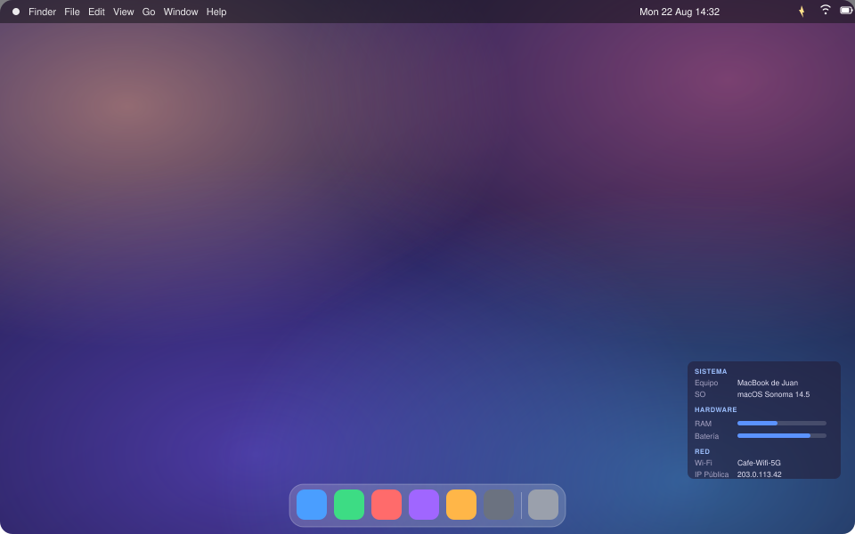
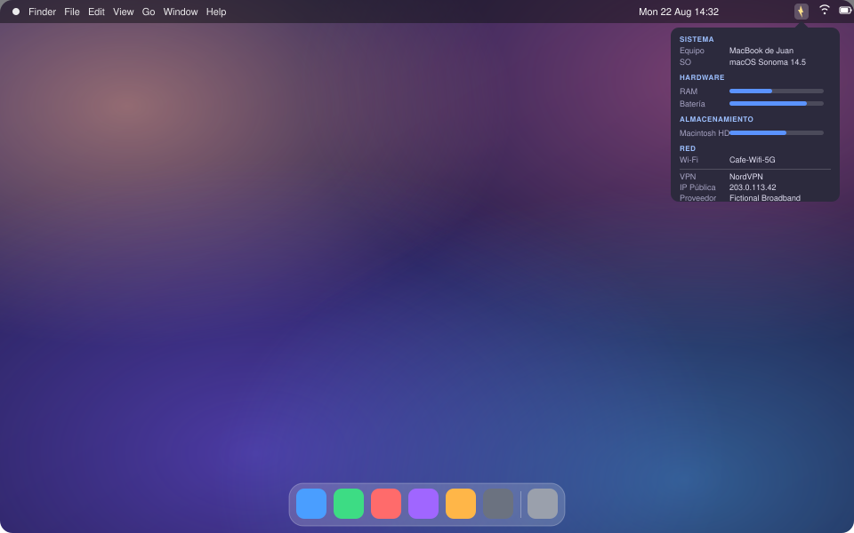

# BGInfoMac

A native macOS alternative to the classic Windows **BGInfo**: it shows system information directly on the desktop background (behind the icons) and in a menu bar popover, both fully and independently configurable.

Current version: **2.1.1** (build 6).

<p align="center">
  
  
</p>

<p align="center"><sub>All data shown above is fictitious, for illustration only.</sub></p>

## What it shows

- **System**: computer name, user, macOS version with marketing name (e.g. "macOS Tahoe 26.6.2"), serial number, OS build, date/time.
- **Hardware**: Mac model, chip, uptime, RAM usage, battery, CPU cores, GPU.
  - RAM and storage bars turn **orange at 80% used and red at 90%** (standard monitoring thresholds).
  - Battery is shown as a bar too, colored by charge level (**blue 100–50%, orange 49–15%, red below 15%**), with a small lightning bolt that animates in with a soft pulse while charging — time remaining (or time until full while charging), health and cycle count show up in the tooltip.
  - CPU cores show the performance/efficiency split on Apple Silicon.
  - GPU shows model and core count when it can be determined.
- **Storage**: every mounted volume, with a usage bar; hovering shows used/free space and the disk format (APFS, NTFS, exFAT, etc.). External and network volumes can be included or excluded from Preferences.
- **Network**: Wi-Fi SSID, all local interfaces with their IP, public IP (with country and flag when it can be determined), and Internet provider (ISP). If a VPN is connected, its data (provider, tunnel IP, public IP, gateway, DNS) is grouped separately below a divider, since it replaces the local network's data while active. If there's no active network connection at all, the section says so instead of showing empty fields. The menu popover also includes a **"Test speed"** button that measures download/upload throughput on demand.
- **Message**: free text you define yourself (hidden by default).

Everything refreshes automatically according to the configured interval (**5 seconds by default**). Both the sections and the fields within each section can be reordered by dragging their handle, shown/hidden individually, and each section can hide its own title independently — all from **Preferences**, and separately for the desktop overlay and the menu popover.

## Help

A searchable manual is available from the menu bar (**Help**, ⌘?): an index of topics on the side, a search field, and a dedicated "Permissions" topic explaining exactly what BGInfoMac asks for and why, with a button to jump straight to the relevant System Settings pane. It's available in the same 5 languages as the rest of the app.

## Supporting the project

BGInfoMac is free. If you find it useful, there's a "Donate via PayPal" button in **About BGInfoMac** and in the Help window's introduction. The menu popover also shows a one-time donation reminder on its 5th opening — press **⌘⇧D** while it's open to turn that reminder off permanently (the button in About and Help stays available regardless).

## Building and running

Requires Xcode Command Line Tools (already installed) — a full Xcode install isn't needed.

```bash
cd BGInfoMac
./Scripts/build_app.sh
open BGInfoMac.app
```

The script builds in release mode, assembles `BGInfoMac.app` at the project root, and ad-hoc signs it (a local signature, enough to run on your own Mac).

You can also open `Package.swift` directly with Xcode (`open Package.swift`) to edit/debug with the IDE.

## Generating an installer (.dmg)

Once the app is built, `Scripts/build_dmg.sh` assembles the typical macOS DMG: opening it shows a window with the app icon and an "Applications" shortcut next to it, ready to drag one onto the other. The DMG itself and the mounted volume also carry the app's custom icon.

```bash
./Scripts/build_app.sh
./Scripts/build_dmg.sh
```

This generates `BGInfoMac-Installer.dmg` at the project root. The script arranges the Finder window (size, large icons, no toolbar) using AppleScript; if your Mac hasn't granted Automation permission to Terminal, the DMG is still generated, just without that neat arrangement — macOS will ask for that permission the first time you run it.

A ready-to-use build of the installer is also attached to this repository's [Releases](../../releases).

## Usage

The app has no Dock icon — it lives in the **menu bar**.

- **Left click** on the icon: opens a **popover** with system information (iStat Menus style), with its own selectable text and graphical bars.
- **Right click**: opens the options menu, from which you can:
  - View "About BGInfoMac" (version, year, donate button).
  - Open **Help…** (⌘?).
  - Show/hide the desktop overlay.
  - Turn "Launch at Login" on or off.
  - Change the refresh interval (Never / 5s / 30s / 1m / 5m). "Never" disables automatic refreshing; data only updates via "Refresh Info" or when a preference changes.
  - **Refresh info** instantly (⌘R).
  - Open **Preferences…** (⌘,) for all the detailed configuration.
  - Quit the app.

### Menu popover vs. desktop overlay

The popover (left click) has its **own section and field configuration**, completely independent from the desktop overlay — you can show different data in each. Both are configured from Preferences → Fields, with a selector at the top to choose whether you're editing "Desktop" or "Menu". The popover has no position/color settings of its own — it always appears anchored below the icon, with native macOS styling.

### Preferences window

The window is **resizable** and has two tabs:

- **Fields**: a selector at the top chooses whether you're configuring the **Desktop** or the **Menu** (popover) — each keeps its own order and visibility, independently. Each section (System, Hardware, Storage, Network, Message) is a row that you **drag by its handle (☰)** up/down to change the order. Each section has:
  - A toggle to show/hide it.
  - A "Show title" checkbox to hide just the header (e.g. "SYSTEM") without hiding the data.
  - Its fields, also individually reorderable by dragging their own handle, each with its own visibility toggle.
  - For Desktop, this tab also includes the "Show On" display selector (see Multiple displays below).
  - The **Message** section includes a text box to write a custom message that appears as one more section (reorderable alongside the others).
- **Appearance**: overlay corner and horizontal/vertical margins (0–400pt), text color, background color, background opacity, font size, **Launch at Login**, app language, and app appearance (System/Light/Dark). Everything applies live to the overlay. This tab also has **Export/Import Settings** buttons to save your whole configuration to a JSON file and load it back (e.g. when moving to another Mac).

Preferences are stored in `UserDefaults` and persist across restarts.

### Language

The app supports **Spanish, English, Italian, German and French**. By default it uses the operating system's language (falling back to English if it's none of the five); it can be set manually from Preferences → Appearance → Language. The Help manual follows the same setting.

### Light/dark appearance

By default the app follows the system's mode. From Preferences → Appearance you can force it to Light or Dark independently of the rest of macOS.

## Launching automatically at login

Turn on the **"Launch at Login"** toggle from the menu bar menu or from Preferences → Appearance (it uses `SMAppService`, the modern macOS API — no need to touch System Settings). For it to work reliably, move `BGInfoMac.app` to `/Applications` instead of leaving it on the Desktop.

## Multiple displays

The "Show On" selector (Preferences → Fields → Desktop) is always visible and lets you choose whether the overlay appears on **all displays** or only on one in particular (identified by its name); the list of displays updates automatically when you connect or disconnect a monitor. If the specific display you chose is later disconnected, the app shows the overlay on all displays again until you reconnect it.

## Notes

- The **Wi-Fi SSID** requires Location permission — macOS requires it for any app that wants to read the connected network's real name. Your actual location is never used, stored or sent anywhere; without the permission, the app still works, it just can't show the Wi-Fi name. See the in-app Help → Permissions topic for details and a direct link to grant it.
- The **public IP**, its **country**, and your **Internet provider** are obtained via simple HTTPS requests to `api.ipify.org` and `ipwho.is`; if there's no internet connection, those lines simply don't appear.
- **VPN detection** works for VPN clients that register through NetworkExtension (the vast majority of modern apps — Surfshark, NordVPN, Tailscale, WireGuard-based clients, Cisco AnyConnect, etc.); purely command-line VPN setups that don't go through NetworkExtension aren't detected.
- The overlay recreates itself automatically when you connect/disconnect monitors.
- Requires macOS 13 (Ventura) or later.

## Project structure

```
BGInfoMac/
├── Package.swift
├── Sources/BGInfoMac/
│   ├── main.swift                     # Entry point
│   ├── AppDelegate.swift              # Orchestrates the timer, data capture and overlay
│   ├── SystemInfoProvider.swift       # System data collection (sysctl, IOKit, SystemConfiguration, network requests)
│   ├── HardwareDisplay.swift          # Shared formatting helpers (CPU cores, battery, lists)
│   ├── CountryDisplay.swift           # Country code/flag formatting for the public IP
│   ├── Preferences.swift              # Preferences persisted in UserDefaults
│   ├── LayoutConfig.swift             # Model for reorderable sections/fields
│   ├── Localization.swift             # UI strings in 5 languages + system detection
│   ├── HelpContent.swift              # Help manual content, in 5 languages
│   ├── HelpView.swift / HelpWindowController.swift  # Searchable Help window
│   ├── DragReorderableList.swift      # Generic drag-to-reorder component (handle-scoped)
│   ├── NetworkChangeMonitor.swift     # Network path change detection (NWPathMonitor)
│   ├── WifiAuthorization.swift        # Location permission handling for Wi-Fi SSID
│   ├── DesktopOverlayController.swift # Borderless windows at desktop level
│   ├── OverlayContentView.swift       # SwiftUI view for the desktop overlay
│   ├── MenuPopoverView.swift          # SwiftUI view for the popover (left click)
│   ├── MenuPopoverController.swift    # NSPopover hosting MenuPopoverView
│   ├── StatusBarController.swift      # Icon, left/right click and menu bar menu
│   ├── PreferencesWindowController.swift  # Preferences window
│   ├── PreferencesView.swift          # Preferences UI (fields, appearance)
│   ├── PreferencesViewModel.swift     # ObservableObject <-> Preferences bridge
│   ├── AboutWindowController.swift / AboutView.swift  # "About" window
│   └── ColorHex.swift                 # NSColor/Color <-> hex conversion
├── Resources/
│   ├── Info.plist
│   ├── AppIcon.icns
│   ├── StatusIcon.png / StatusIcon@2x.png
│   └── IconSource/                    # Master PNGs generated by Scripts/generate_icon.swift
└── Scripts/
    ├── build_app.sh                   # Builds and packages the .app
    ├── build_dmg.sh                   # Generates the .dmg installer (drag to Applications, custom icon)
    └── generate_icon.swift            # Generates the icon assets
```

## License

MIT — see [LICENSE](LICENSE).
